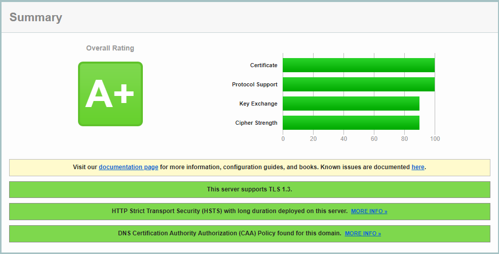

# Home Automation using CoT
 Application of Cloud of Things on Home Automation. A project part of final year studies.

# Context
This project aims to prototype a home automation system with as many appliances and connected objects as possible. One other goal is also to give homeowners full control over their homes to make interractions much easier. The goals of this project are briefly: 
- Conception and realize a full prototype of a home automation system with the ability to connect and control it remotely.
- Use different Inner and Outer network technologies: APIs, MQTT.
- Use devices that are easy to install
- Make it suitable for inexperienced users or even disabled users.
- Scalability: The network needs to be scalable, which means that the possibility to add new objects to the IoT network should be easy, and the integration of the new object in the control application needs to be straightforward.
# Live Demo
As for now, you can test the application by downloading the `.apk` file from the releases.
Also, you can test the application directly from your browser at: TBA. (note that some features are mobile specific and not all of then can be tested via the web version.)
# Installation Guide
We made sure that the architecture of the repository is well organized for users to test the project locally or build on it.
If you want to run the application localy please follow the following steps: 
- Clone the repo: `git clone https://github.com/GhaziXX/Home-Automation-using-CoT.git`
- Install node RED on your Raspberry pi and then load the content of [flows.json](./iot/flows.json) into a new flow. Feel free to change the sensors and actuators pins, the MQTT broker and the API link for getting list of installed sensors.
- Move into the [api](./api/) directory and run `npm install` to install the required dependencies. (Please make sure that you have **node.js** installed in your machine).
- Open [env.config.js](./api/main/env.config.js) and set your own settings (certificate path, mqtt broker settings and you Mongodb link). 
- Run `npm start` to start the server locally.
- Move into the [frontend](./frontend/) directory - make sure that you have flutter installed on your machine - and run `flutter pub get` Then select whether you want to run on your mobile, emulator or web and run `flutter pub run`.
# Technologies
Multiple technologies, plugins, packages and hardware sensors and actuators were used while developing this project, the technologies are diverse and used for backend and frontend development.
- Backend:
  - Node.js: v16.13.1
  - Express: v4.17.1
  - Mongoose: v6.0.6
  - Passport: v0.4.1
  - Other usefull Node.js packages
- IoT:
  - Node RED
  - Communication protocols (I²C, SPI)
- Frontend
  - Flutter
  - Google Maps API
  - Dio (Network handeling)
  - Secure Storage (Secure jwt_token storage)
  - GetX (State Management)
  - Other usefull flutter packages
- Server
  - Mosquitto Broker
- Hardware
  - Raspberry Pi 4
  - Gas sensor MQ-2
  - Motion sensor PIR
  - CO sensor MQ135
  - Temperature & humidity sensor DHT11
  - Photo-resistor
# Deployment Server
Two virtual machines from Google Cloud were used for running the project. (Basically, Google provides us with a 300$ to use them to try the diffrent GCP products)
The first VM is dedicated to run the Node.js API server (Middleware) and the second VM was setup as an MQTT broker using [Mosquitto](https://mosquitto.org/). We took that approach to increase the security and make sure that everything run smothely without interception. But, it is not necessary to use two separate machine, you can just use one VM as MQTT broker and Middleware.
The VMs are both e2-small machines (optimized for web hosting and serving (i.e. day to day usage)) and have the following caracteristics:
- Ram: 2 Gib
- cores: 0.5
- vCPUs: 2
- Storage: 10 Gib
- Zone: us-central1-a
# Certification and Grading
HTTPS was ensured using Let's Encrypt's Certbot, isuring a secure communication with the middlware and the MQTT broker. DH (Diffie-Hellman parameters) parameters with a length of 4096 bits are also using for TLS connections. In addition to that, some other security parameters were set on the Node.js server to ensure max security.
The grading of the server was tested using [SSLlabs](https://www.ssllabs.com/) and we had a grade of A+.

# Screenshots
# Further Readings
You can find more information and take a look about the architecture design with the folowing documents:
-  [User Guide](docs/User%20Guide.pdf)
-  [Design Document](docs/Design%20Document.pdf)
